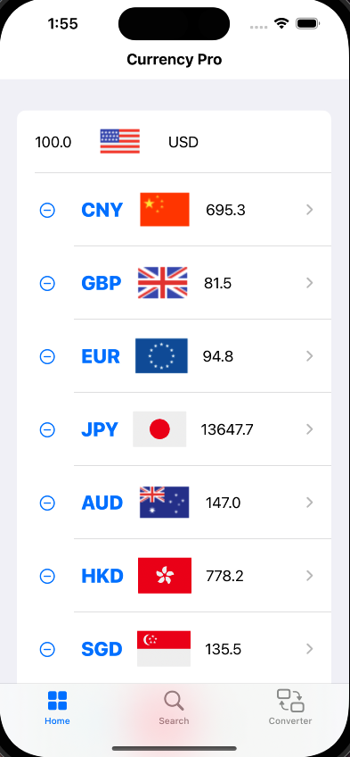
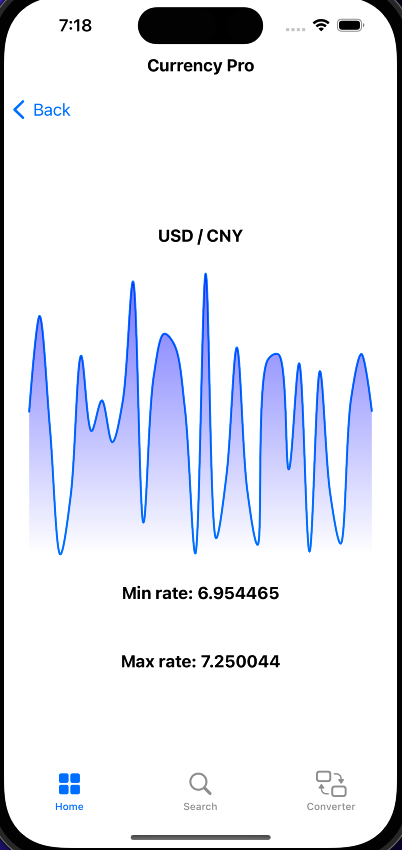
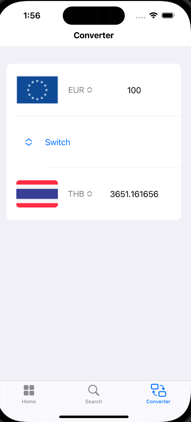
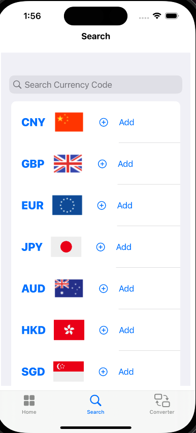

# Real Currency

## List of features
Feature - Home Page List Default Currencies
Currently the home page displays a list of currency converting results of exchange 100 USD based on static JSON data. Will read data from currency API in next release.
Task breakdown:
- call API to get data (future)
- parse data into Swift object (currently read from static JSON)
- convert 100 USD to selected countries’ currencies in the list (future user can customize the list)
- add a country to the list (future)
- remove a country from the list (future)

Feature - Search function
Currently the user can navigate to the search page by tapping the “Search” icon on the bottom of the main screen. User can type in a country name to search for the currency on this prototype. For example, if type “un”, the result will show currency for United States and United Kingdom. Future search function will also allow search for the three letter currency id, “USD” for example. 
Task breakdown: 
- create search bar
- get user input
- filter result based on user input
- link filter result to CurrencyListView and display the result

Feature - Calculate Currency
Allows the user to select a country currency and convert to another currency with the user input amount. Ability to switch currency without re-selecting.
Task breakdown: 
- display a list of country flag and get user selection
- allow input amount, numbers only
- switch function
- read JSON currency data, calculate currency and display result

Feature - Setting
Allows user to set their preferences include default currency, app language, text size, price alert(future), and accessibility.
Task breakdown:
- achieve a list of setting
- achieve a picker of default language
- achieve a picker of app language
- achieve a picker of text size
- achieve two toggles for color invert and spoken content

## Basic functionality implemented:
- View a list of live currency information

- View weekly history trend

- Calculate currency

- Search currency  

## User privacy and app security
CurrencyPro does not require collecting user data. No account sign-in is needed. It follows Apple App Store Review Guidelines and respects the user's persmission settings.

## User experience
- Users can easily view the latest exchange rate information
- Users can easily get the exchange rate of the country they need
- Users cam easily calculate the value of the currency
